<p align="center"><a
href="https://www.flaticon.com/free-icons/mortarboard" target="_blank" rel="noopener noreferrer"
title="Mortarboard icons created by itim2101 - Flaticon" ></a></p>

# Moodle-gpt v1.0.1

This extension allows you to hide CHAT-GPT in a Moodle quiz. You just need to enter <b>the code configured in the extension</b> on the keyboard and then click on the question you want to solve, and CHAT-GPT will automatically provide the answer. However, one needs to be careful because as we know, CHAT-GPT can make errors especially in calculations.

## Disclaimer !

I hereby declare that I am not responsible for any misuse or illegal activities carried out using my program. The code is provided for educational and research purposes only, and any use of it outside of these purposes is at the user's own risk.

## Update

See [changelog](./CHANGELOG.md)

## MoodleGPT don't complete my quiz ?

If MoodleGPT cannot complete one of your moodle quiz please provide the html code of the page. It will help us to add it in the futur version of MoodleGPT ! Check the [TODO](./TODO.md) to see what is comming in the futur version.

## Set up

> NOTE: This extension only works on Chromium-based browsers like Edge, Chrome, etc. Unfortunately, Firefox requires a click on the extension, which is not very discreet.

Go to <b>"Manage my extensions"</b> on your browser, then click on <b>"Load unpacked extension"</b> and select the <b>"extension"</b> folder. Afterwards, click on the extension icon and enter the apiKey obtained from [openai](https://platform.openai.com/) and enter a <b>code</b> that will activate the extension on your moodle page. Finally, click on the <b>reload button</b> next to model (it should give you the last ChatGPT version, otherwise enter it by your self) and click on the save button (The extension need to be configured before entering the moodle quiz).

## Inject the code into the moodle

You just need to enter on the keyboard the <b>code</b> you have set into the extension and clique on the question you want to solve.

## Remove injection

Type back the <b>code</b> on the keyboard and the code will be removed from the current page.

## Options

<p align="center">
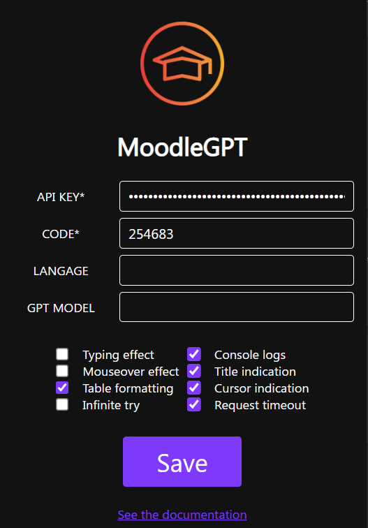
</p>

- <b>Api key</b>: the openai api key.
- <b>Code</b>: code that you will need to inject/remove the code.
- <b>GPT Model</b>: the gpt model you want to use. You can click on the reload button to get the latest version of available gpt model for your account but you need to enter the api key first.
- <b>Cursor indication</b>: show a pointer cursor and a hourglass to know when the request is finished.
- <b>Title indication</b>: show some informations into the title to know for example if the code have been injected.
  <br/> 
- <b>Console logs</b>: show logs into the console.
  <br/>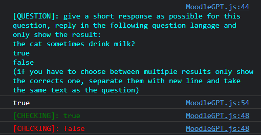
- <b>Request timeout</b>: if the request is too long it will be abort after 10seconds.
- <b>Typing effect</b>: create a typing effect for text. Type any text and it will be replaced by the correct one. If you want to stop it press <b>Backspace</b> key.
  <br/> 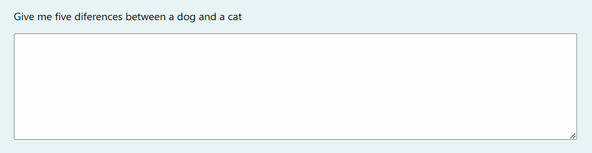
- <b>Mouseover effect</b>: you will need to hover (or click for select) the question response to complete it automaticaly.
  <br/> 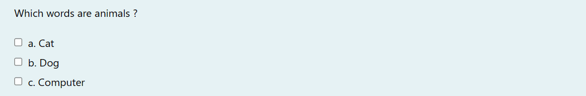
  <br/> 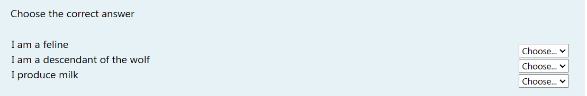
- <b>Table formatting</b>: format table from the question to make it more readable for CHAT-GPT but cost most tokens (so if the question is too large it will make an error). Example of formatted table:

```
| id       | name  | birthDate  | cars |
----------------------------------------
| Person 1 | Yvick | 15/08/1999 | yes  |
| Person 2 | Yann  | 19/01/2000 | no   |
```

- <b>Infinite try</b>: click as much as you want on the question (don't forget to reset the question).

## Supported questions type

### Select

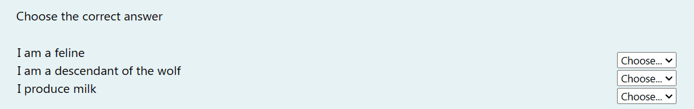

### Put in order question

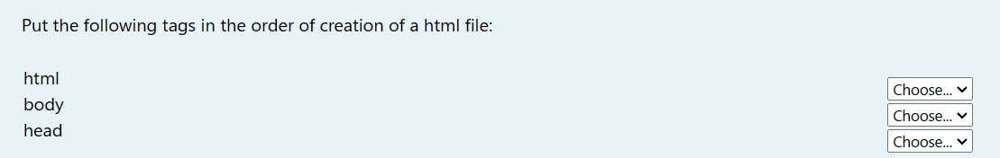

### Resolve equation

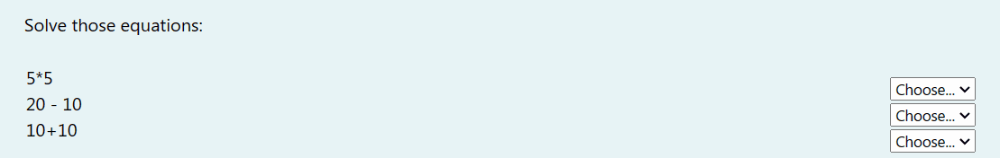

### One response (radio button)


### Multiples responses (checkbox)

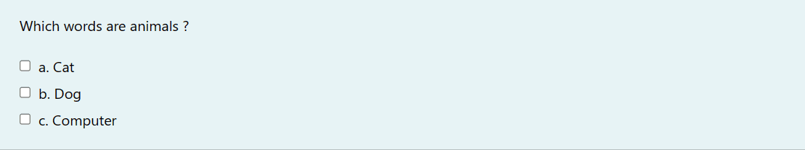

### True or false

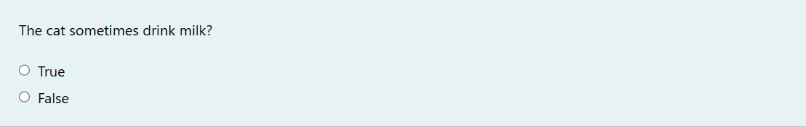

### Number

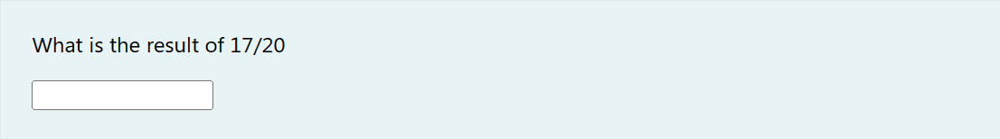

### Text

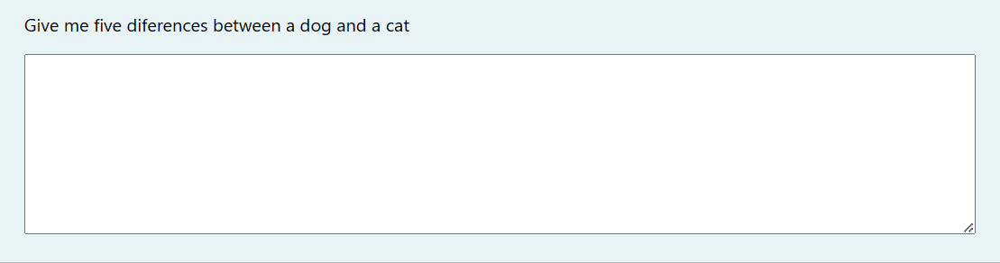

## If it can't complete the question, the answer will be copied to your clipboard

To know if the answer has been copied to the clipboard, you can look at the title of the page which will become <b>"Copied to clipboard"</b> for 3 seconds.

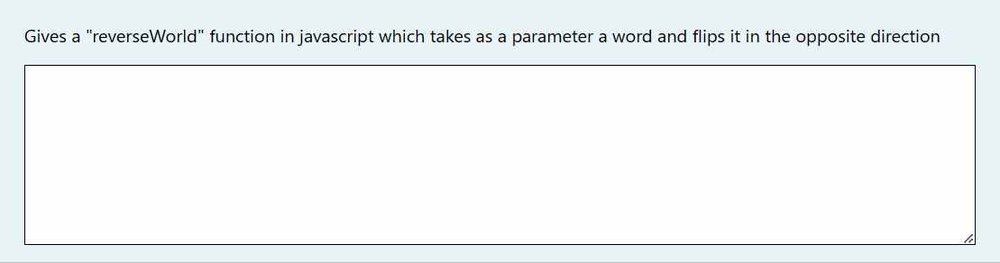

## Test

To test the code, you can run the index.html file located in the <b>"test"</b>. Or a better solution is to install moodle locally.
