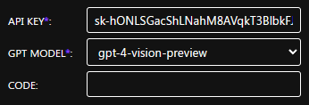
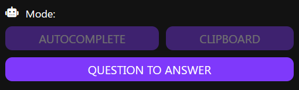
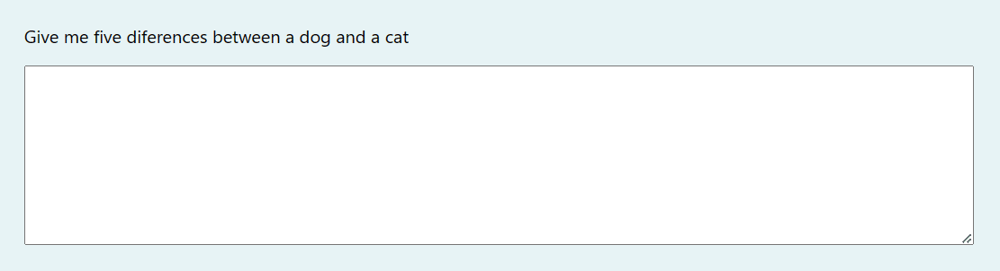
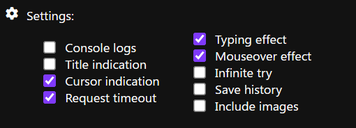
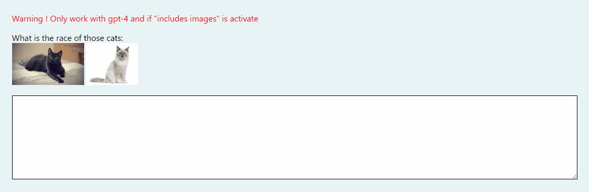
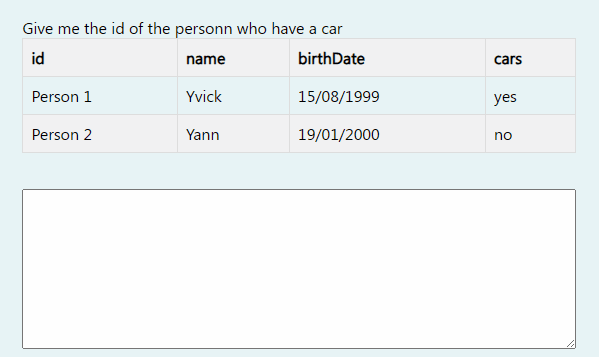
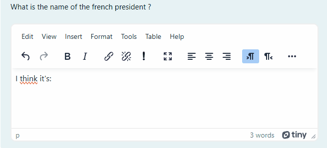

<p align="center"><a
href="https://www.flaticon.com/free-icons/mortarboard" target="_blank" rel="noopener noreferrer"
title="Mortarboard icons created by itim2101 - Flaticon" ></a></p>

# MoodleGPT 1.1.2

This extension allows you to hide CHAT-GPT in a Moodle quiz. You just need to click on the question you want to solve, and CHAT-GPT will automatically provide the answer. However, one needs to be careful because as we know, CHAT-GPT can make errors especially in calculations.

## Chrome Webstore

Find the extension on the Chrome Webstore right [here](https://chrome.google.com/webstore/detail/moodlegpt/fgiepdkoifhpcgdhbiikpgdapjdoemko)

## Summary

- [MoodleGPT 1.1.2](#moodlegpt-112)
  - [Chrome Webstore](#chrome-webstore)
  - [Summary](#summary)
  - [Disclaimer !](#disclaimer-)
  - [Donate](#donate)
  - [Update](#update)
  - [Set up](#set-up)
  - [Mode](#mode)
  - [Settings](#settings)
  - [Internal other features](#internal-other-features)
    - [Support table](#support-table)
  - [Supported questions type](#supported-questions-type)
    - [Select](#select)
    - [Put in order question](#put-in-order-question)
    - [Resolve equation](#resolve-equation)
    - [One response (radio button)](#one-response-radio-button)
    - [Multiples responses (checkbox)](#multiples-responses-checkbox)
    - [True or false](#true-or-false)
    - [Number](#number)
    - [Text](#text)
    - [Atto](#atto)
  - [What about if the question can't be autocompleted ?](#what-about-if-the-question-cant-be-autocompleted-)
  - [Test](#test)
  - [Beta version with advanced features](#beta-version-with-advanced-features)

## Disclaimer !

I hereby declare that I am not responsible for any misuse or illegal activities carried out using my program. The code is provided for educational and research purposes only, and any use of it outside of these purposes is at the user's own risk.

## Donate

Will be a pleasure if you want to support this project :). I'm alone working on this project and I'm still a student.
<br/>
<a href="https://www.buymeacoffee.com/yoannchbpro" target="_blank" rel="noopener noreferrer"></a>

## Update

See the [changelog](./CHANGELOG.md) to see every updates !

## Set up

> NOTE: This extension only works on Chromium-based browsers like Edge, Chrome, etc.

<p align="center">

</p>

Go to <b>"Manage my extensions"</b> on your browser, then click on <b>"Load unpacked extension"</b> and select the <b>"extension"</b> folder. Afterwards, click on the extension icon and enter the ApiKey obtained from [openai api](https://platform.openai.com/api-keys). Finally, select a [gpt model](https://platform.openai.com/docs/models) (ensure it work with completion api).

## Mode

<p align="center">

</p>

- <b>Autocomplete:</b> The extension will complete the question for you by selecting the correct(s) answer(s).
- <b>Clipboard:</b> The response is copied into the clipboard.
- <b>Question to answer:</b> The question is converted to the answer and you can click on it to show back the question (or show back the answer).
  <br/>

## Settings

<p align="center">

</p>

- <b>Api key\*</b>: the [openai api key](https://platform.openai.com/api-keys) from your account (Note you have to put credits by entering a credit card onto your account).
- <b>GPT Model\*</b>: the [gpt model](https://platform.openai.com/docs/models) you want to use.
- <b>Code</b>: a code to be more discret for injecting/removing the extension from the page. Simply type your code you entered into the configuration on the keyboard when you are on your moodle quiz and the extension will be inject. If you want to remove the injection just simply type back the code on your keyboard.
- <b>Cursor indication</b>: show a pointer cursor and a hourglass to know when the request is finished.
- <b>Title indication</b>: show some informations into the title to know for example if the code have been injected.
  <br/> 
- <b>Console logs</b>: show logs into the console for the question, chatgpt answer and which response has been chosen.
  <br/>
- <b>Request timeout</b>: if the request is too long it will be abort after 20 seconds.
- <b>Typing effect</b>: create a typing effect for text. Type any text and it will be replaced by the correct one. If you want to stop it press <b>Backspace</b> key.
  <br/> 
- <b>Mouseover effect</b>: you will need to hover (or click for select) the question response to complete it automaticaly.
  <br/> 
  <br/> 
- <b>Infinite try</b>: click as much as you want on the question (don't forget to reset the question).
- <b>Save history</b>: allows you to create a conversation with ChatGPT by saving the previous question with its answer. However, note that it can consume a significant number of tokens.
- <b>Include images</b> (only work with gpt-4): allows you to include the images from the question to be send to the chatgpt api. The quality is reduced to 75% to use less tokens. However, note that it can consume a significant number of tokens.
  <br/> 

## Internal other features

### Support table

Table are formated from the question to make it more readable for CHAT-GPT. Example of formatted table output:

```
id       | name  | birthDate  | cars
------------------------------------
Person 1 | Yvick | 15/08/1999 | yes 
Person 2 | Yann  | 19/01/2000 | no
```



## Supported questions type

### Select


### Put in order question


### Resolve equation


### One response (radio button)


### Multiples responses (checkbox)


### True or false


### Number


### Text


### Atto



## What about if the question can't be autocompleted ?

To know if the answer has been copied to the clipboard, you can look at the title of the page which will become <b>"Copied to clipboard"</b> for 3 seconds if `Title indication` is on.


## Test

- <b>Solution 1</b>: Go on this [moodle demo page](https://moodle.org/demo).
- <b>Solution 2</b>: Run the `index.html` file located in the `test/fake-moodle` folder.

## Beta version with advanced features

If you're interested in accessing advanced features ahead of their official release, please consider downloading the extension from the [dev branch](https://github.com/yoannchb-pro/MoodleGPT/tree/dev). However, please be aware that this branch is under development and may contain bugs. If you encounter any issues, don't hesitate to contact me or create an issue on GitHub. Your feedback is invaluable in helping us improve the extension.
